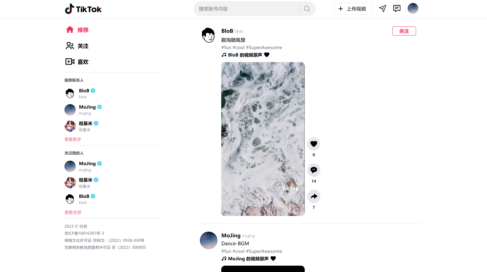
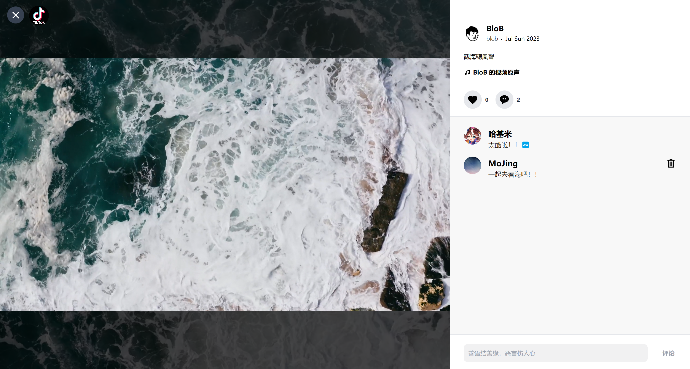
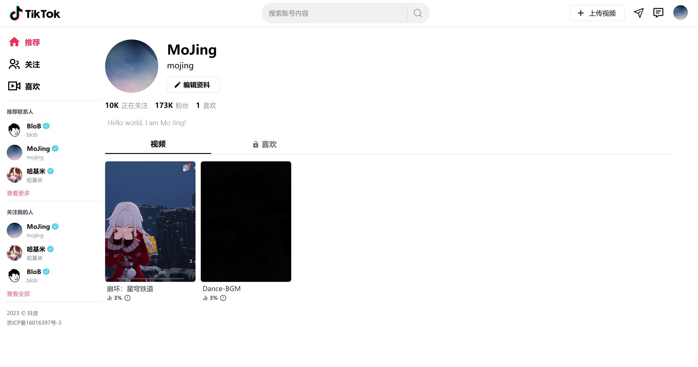
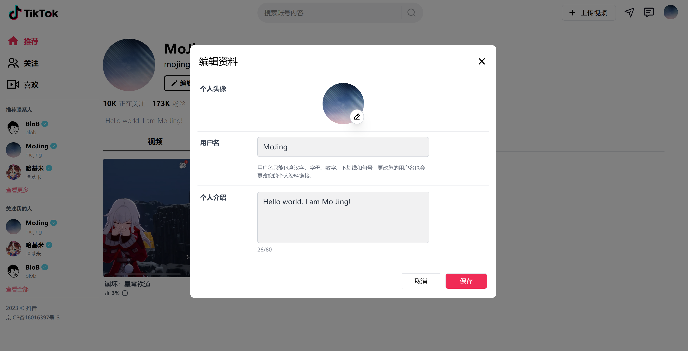
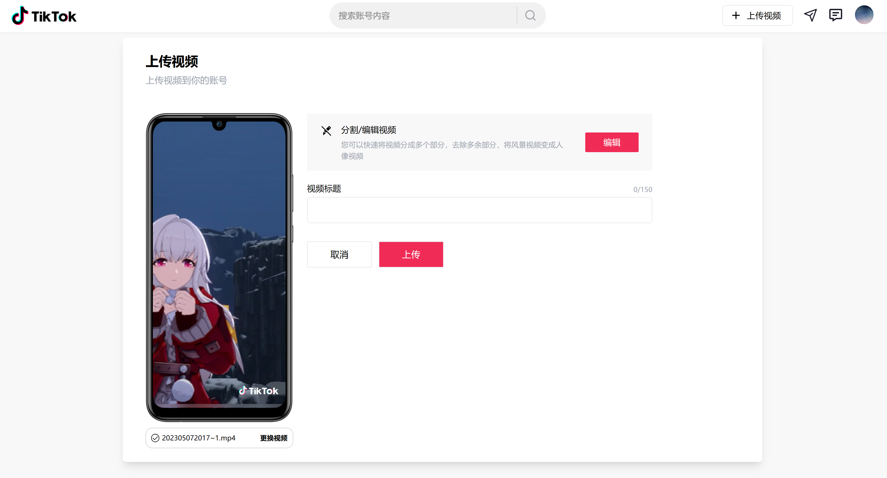
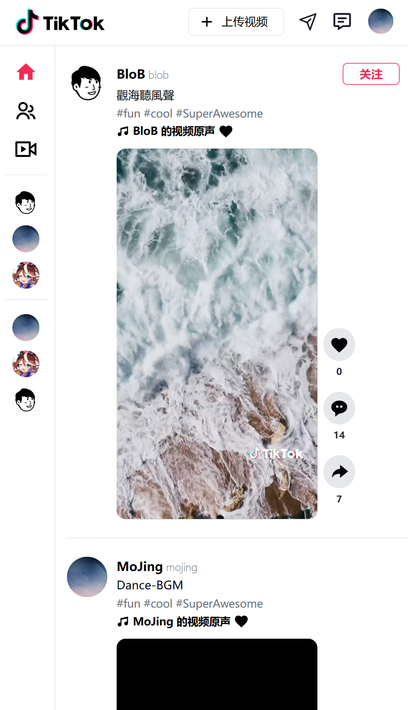
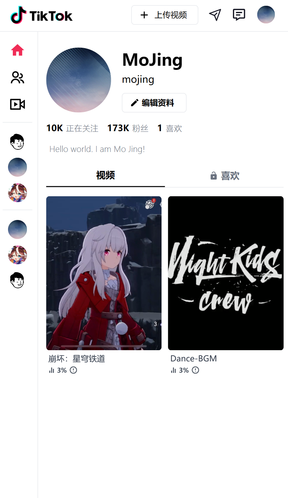
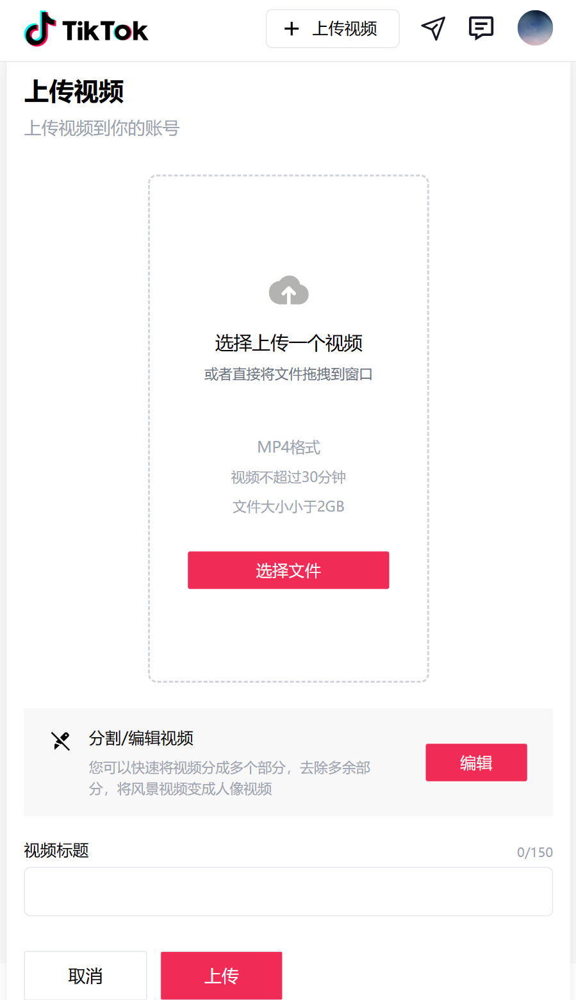

# 基于Nuxt.js+Laravel复刻实现tiktok网页版(API)


本项目为mojing-tiktok-clone-nuxt的后端部分，采用Laravel框架+MySQL实现，前端见项目[mojing122/mojing-tiktok-clone-nuxt (github.com)](https://github.com/mojing122/mojing-tiktok-clone-nuxt/)

项目参考John-Weeks-Dev的教程[youtube.com/watch?v=CHSL0Btbj_o](https://www.youtube.com/watch?v=CHSL0Btbj_o)

预览：


网页预览：https://tiktok.mojing.live

Github：[mojing122/mojing-tiktok-clone-api-laravel (github.com)](https://github.com/mojing122/mojing-tiktok-clone-api-laravel)

Gitee：[mojing-tiktok-clone-api-laravel (gitee.com)](https://gitee.com/sha-zhiqing/mojing-tiktok-clone-api-laravel)

## 实现功能

- [x] 登录、注册
- [x] 登录拦截器
- [x] 首页
  - [x] 滚动页面自动播放/暂停
  - [x] 点赞
  - [x] 随机展示其他用户
- [x] 个人资料页
  - [x] 上传头像（需权限）
  - [x] 修改个人资料（需权限）
  - [x] 展示个人上传视频
- [x] 上传视频
- [x] 视频详情页
  - [x] 上下切换视频
  - [x] 点赞、评论
  - [x] 删除视频（需权限）
- [ ] ……

## 项目运行

```bash
composer install 

cp .env.example .env 
```

修改.env中的DB_DATABASE、DB_USERNAME、DB_PASSWORD等配置

```
DB_CONNECTION=mysql
DB_HOST=127.0.0.1
DB_PORT=3306
DB_DATABASE=[database name]
DB_USERNAME=[database username]
DB_PASSWORD=[database password]
```

连接数据库并运行服务

```bash
php artisan cache:clear 

composer dump-autoload 

php artisan key:generate

composer require laravel/breeze --dev

php artisan breeze:install 

php artisan serve
```

创建数据表

```bash
php artisan migrate
```

## 项目截图

### 大屏效果：












### 小屏效果：

|                 |  |
| ------------------------------------------------------------ | ------------------------------------------------------------ |
|  |  |


## 更多信息

文档站：https://docs.mojing.live

## License

Copyright [2023] [Sha Zhiqing]

   Licensed under the Apache License, Version 2.0 (the "License"); you may not use this file except in compliance with the License.You may obtain a copy of the License at http://www.apache.org/licenses/LICENSE-2.0

   Unless required by applicable law or agreed to in writing, softwaredistributed under the License is distributed on an "AS IS" BASIS, WITHOUT WARRANTIES OR CONDITIONS OF ANY KIND, either express or implied. See the License for the specific language governing permissions and limitations under the License.

## About me


MoJing 人工智能专业大三本科生